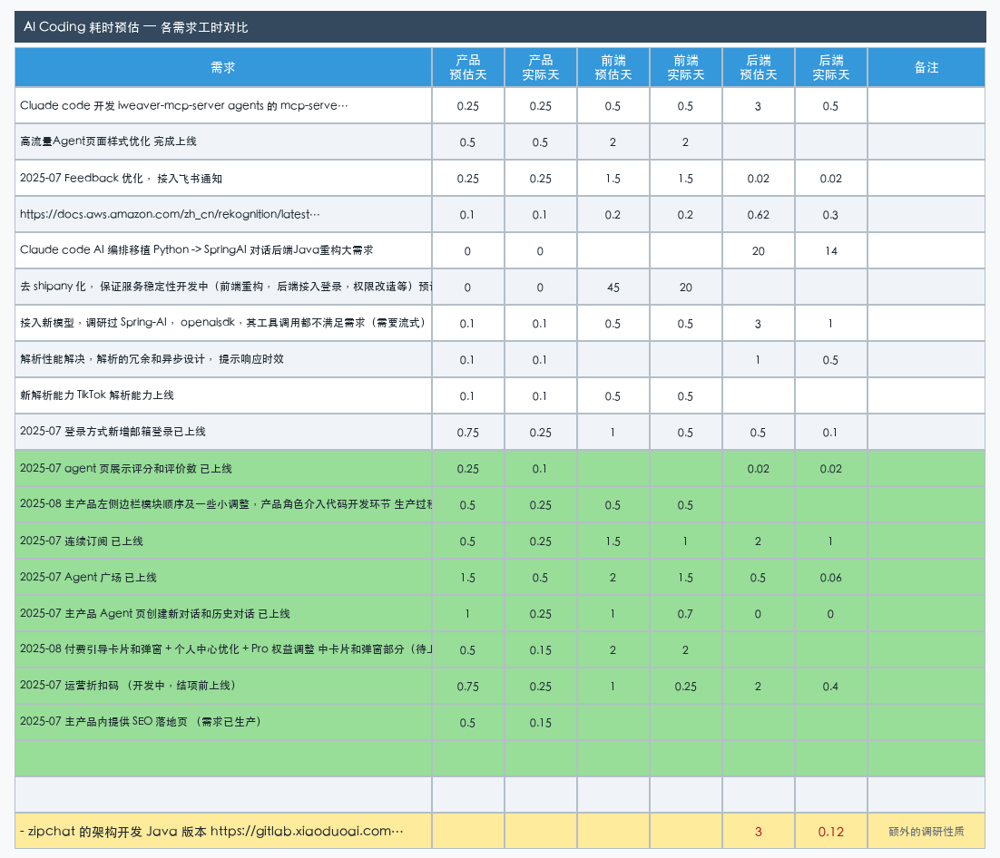
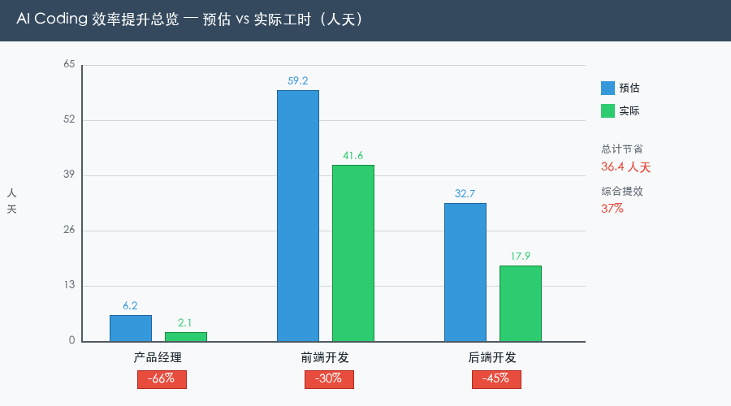

# AI Coding 耗时预估 — 各需求工时对比

> 本表整理自真实项目数据，记录了借助 AI（Claude Code / Trae Solo）开发各需求的预估人天 vs 实际人天，直观展示 AI 辅助编程的提效幅度。

---

## 数据总览

> 绿色行 = 使用 AI 辅助生产的需求（Trae Solo 生产需求文档）

---

## 效率提升汇总

| 角色 | 预估人天 | 实际人天 | 节省人天 | 提效幅度 |
|------|---------|---------|---------|---------|
| 产品经理 | 6.25 | 2.15 | **4.1** | **-66%** |
| 前端开发 | 59.2 | 41.65 | **17.55** | **-30%** |
| 后端开发 | 32.67 | 17.90 | **14.77** | **-45%** |
| **合计** | **98.12** | **61.70** | **36.42** | **-37%** |

---

## 各需求明细

### 非 AI 辅助需求

| 需求 | 产品预估 | 产品实际 | 前端预估 | 前端实际 | 后端预估 | 后端实际 |
|------|---------|---------|---------|---------|---------|---------|
| Claude Code 开发 my-mcp-server（agents 的 mcp-server 服务，支持 fastgpt、cherry studio、coze、dify 等）| 0.25 | 0.25 | 0.5 | 0.5 | 3 | **0.5** |
| 高流量 Agent 页面样式优化 完成上线 | 0.5 | 0.5 | 2 | 2 | — | — |
| 2025-07 Feedback 优化，接入飞书通知 | 0.25 | 0.25 | 1.5 | 1.5 | 0.02 | 0.02 |
| 图片暴力色情检测，接 AWS Rekognition API | 0.1 | 0.1 | 0.2 | 0.2 | 0.625 | **0.3** |
| Claude Code AI 编排移植 Python → SpringAI 对话后端 Java 重构大需求 | 0 | 0 | — | — | 20 | **14** |
| 去 shipany 化，保证服务稳定性（前端重构、后端接入登录、权限改造等）节约成本 $900/月 | 0 | 0 | 45 | **20** | — | — |
| 接入新模型（调研 Spring-AI、openaisdk，自主开发 openai sdk，接入 AWS Bedrock Claude、GPT-5、Gemini 2.5 Pro 等） | 0.1 | 0.1 | 0.5 | 0.5 | 3 | **1** |
| 解析性能解决，解析的冗余和异步设计，提升响应时效 | 0.1 | 0.1 | — | — | 1 | **0.5** |
| 新解析能力 TikTok 解析能力上线 | 0.1 | 0.1 | 0.5 | 0.5 | — | — |
| 2025-07 登录方式新增邮箱登录 已上线 | 0.75 | **0.25** | 1 | **0.5** | 0.5 | **0.1** |

### AI 辅助需求（Trae Solo 生产需求文档）

| 需求 | 产品预估 | 产品实际 | 前端预估 | 前端实际 | 后端预估 | 后端实际 |
|------|---------|---------|---------|---------|---------|---------|
| 2025-07 agent 页展示评分和评价数 已上线 | 0.25 | **0.1** | — | — | 0.02 | 0.02 |
| 2025-08 主产品左侧边栏模块顺序及小调整，产品角色介入代码开发 | 0.5 | **0.25** | 0.5 | 0.5 | — | — |
| 2025-07 连续订阅 已上线 | 0.5 | **0.25** | 1.5 | **1** | 2 | **1** |
| 2025-07 Agent 广场 已上线 | 1.5 | **0.5** | 2 | **1.5** | 0.5 | **0.0625** |
| 2025-07 主产品 Agent 页创建新对话和历史对话 已上线 | 1 | **0.25** | 1 | **0.7** | 0 | 0 |
| 2025-08 付费引导卡片和弹窗 + 个人中心优化 + Pro 权益调整（待上线）| 0.5 | **0.15** | 2 | 2 | — | — |
| 2025-07 运营折扣码（开发中，结项前上线）| 0.75 | **0.25** | 1 | **0.25** | 2 | **0.4** |
| 2025-07 主产品内提供 SEO 落地页（需求已生产）| 0.5 | **0.15** | — | — | — | — |

### 额外调研性质工作

| 需求 | 后端预估 | 后端实际 | 备注 |
|------|---------|---------|------|
| zipchat 架构开发 Java 版本 | 3 | **0.125** | 额外的调研性质 |
| zipchat 架构开发 Python 版本 | 3 | **0.125** | 额外的调研性质 |
| 重写 openai sdk（按实际需求定制）| 3 | **0.375** | 额外的调研性质 |

---

## 关键洞察

### 产品经理提效最显著（-66%）

- **传统方式**：逐页标注原型、跨页面对齐逻辑，6.25 天 → 实际只用 2.15 天
- **AI 方式**：Trae Solo 生成需求文档，AI 写的文档给 AI 开发用，大幅降低文档生产成本
- **典型案例**：Agent 广场（预估 1.5 天 → 实际 0.5 天）、主产品 Agent 页对话（预估 1 天 → 实际 0.25 天）

### 后端提效最明显（-45%）

- **典型案例**：
  - my-mcp-server：后端预估 3 天 → 实际 **0.5 天**（36 分钟）
  - Python → SpringAI 迁移：预估 20 天 → 实际 **14 天**
  - 图片检测 API 接入：预估 0.625 天 → 实际 **0.3 天**
  - 接入新模型（多个）：预估 3 天 → 实际 **1 天**
  - 解析性能优化：预估 1 天 → 实际 **0.5 天**
  - zipchat 调研开发（×3）：预估合计 9 天 → 实际合计 **0.625 天**

### 前端提效稳定（-30%）

- 前端工作量较大（59.2 天预估），AI 主要在需求明确的标准页面开发中提效
- 去 shipany 化重构：预估 45 天 → 实际 **20 天**（节省 55%）

---

## 方法论对应

| 提效场景 | 使用工具 | 对应文章 |
|---------|---------|---------|
| 需求文档生产 | Trae 2.0 Solo | [借助 Trae 2.0 Solo 实现需求生产 100%+ 提效](trae-solo-需求生产提效.md) |
| 后端从零开发 | Claude Code | [Claude Code 开发 my-mcp-server](claude-code-开发mcp-server.md) |
| 大型项目迁移 | Claude Code AI 编排 | [Claude Code AI 编排玩法](claude-code-ai-编排玩法.md) |

> **核心结论**：AI 辅助编程在各角色均有显著提效，产品 -66%、后端 -45%、前端 -30%，综合节省 **37%** 工时，约 36 人天。
