# Claude Code AI 编排玩法：用 AI 移植 Python 项目到 Spring AI

> 本文整理自一个真实案例：用 Claude Code 将一个 Python AI 服务（FastAPI）完整移植到 Java（Spring AI），历时约 2 天（投入 ~8h），完成 46 个 API 开发，自测 1 次通过率 100%，联调一次通过率 95.65%。

---

## 玩法一：CLAUDE.md 注入项目上下文

**问题**：开发过程中 Claude Code 容易忘记前面提到的两个项目，做改造时根据自己的理解来做，而不是参考 Python 项目的代码。

**解法**：在项目根目录创建 `CLAUDE.md` 文件，把项目的关键信息写进去，Claude Code 每次启动都会自动读取。

内容包括：
- 项目概述和架构
- Build & Run 命令
- 关键技术栈
- 重要注意事项（如 Spring AI 是 SNAPSHOT 版本、Chat logs 用 String UUID 等）
- 数据库 Schema 结构

```markdown
# CLAUDE.md
This file provides guidance to Claude Code (claude.ai/code) when working with
code in this repository.

## Project Overview
This repository contains two main AI service projects:
1. **ai-service**: Spring Boot-based multi-AI platform (Java/Maven)
2. **ai-python-service**: FastAPI-based service with GeoGebra Integration (Python)

## Build and Run Commands
### Java Service (ai-service)
```bash
# Build all modules
mvn clean compile
# Run main web application
mvn spring-boot:run -pl web
```

## Architecture
**Key Technologies**:
- Spring AI 1.0.0-SNAPSHOT (unstable, simplified implementations)
- PostgreSQL with MyBatis Plus
- SSE streaming (ai-sdk format, no "data:" prefixes)
- Multi-LLM support: OpenAI, Azure OpenAI, DeepSeek, Claude, Gemini, Doubao

**Critical Notes**:
- Spring AI SNAPSHOT version requires frequent testing with `mvn clean compile`
- Chat logs use String UUID IDs (not bigint)
```

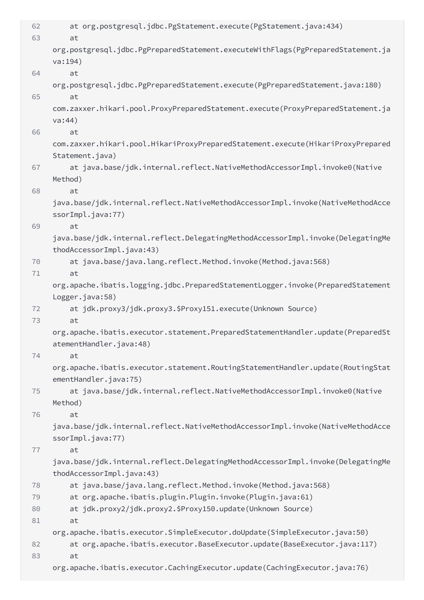

**效果**：Claude Code 在分析代码库后自动创建了 CLAUDE.md，后续操作都会参考这个上下文，不会因为遗忘而乱改。

---

## 玩法二：需求文档驱动开发（迭代式 Prompt）

**核心思路**：不是一次性把所有需求喂给 Claude，而是按阶段拆分成多个需求文档，每个文档解决一类问题。

### 需求文档结构模板

```markdown
基于 [已完成的工作描述]，现在依然存在遗漏的业务逻辑，对我非常重要。

# BUG修复
1. [具体bug描述 + 错误日志]
2. [具体bug描述]

# 功能缺失
1. [缺失功能描述，附 Python 参考代码]
2. [缺失功能描述]

# 确实的业务逻辑
1. [业务逻辑描述 + 代码示例]
```

### 第一天的 4 轮需求迭代

| 轮次 | 内容 | 关键技巧 |
|------|------|---------|
| 需求文档 1 | 初始迁移框架 + Python 核心逻辑 | 用 context7 查 Spring AI 文档 |
| 需求文档 2 | BUG 修复（SSE 前缀、DB 报错） | 直接粘贴错误日志 |
| 需求文档 3 | 补充遗漏业务逻辑 + 工具调用逻辑 | 补充 CLAUDE.md，提供 Python 参考代码 |
| 需求文档 4 | 功能测试后的 BUG 修复 + 人工 review | 人工介入查 Spring AI 文档解决疑难问题 |

---

## 玩法三：零散错误修复 — 直接粘贴 IDE 报错

**最简单的玩法**：遇到编译错误，直接把 IDE 的报错复制进去。

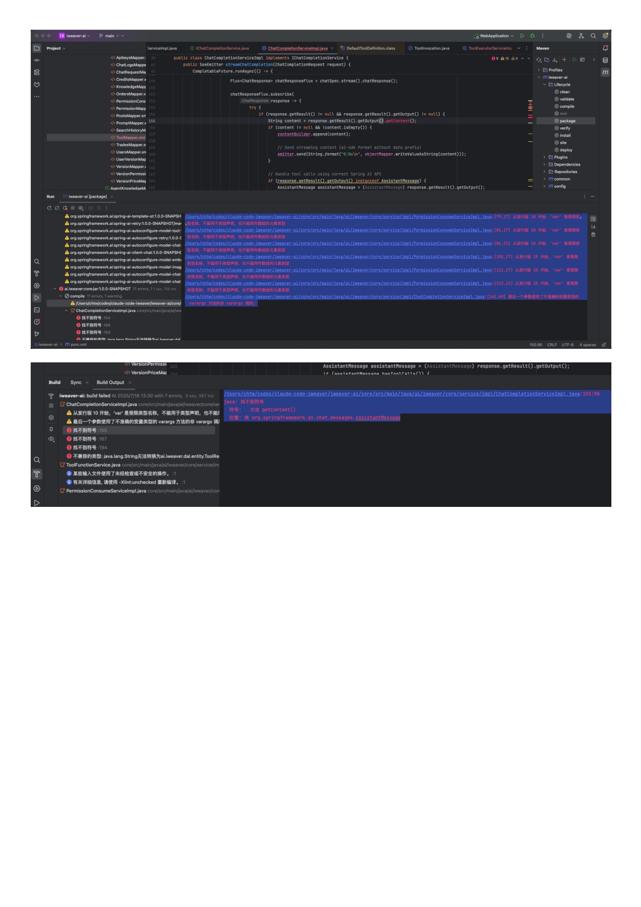

Claude Code 会自动分析所有错误并逐一修复：

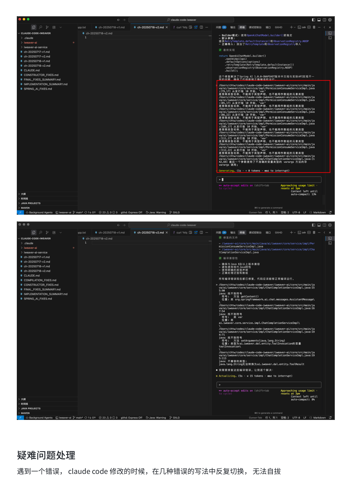

**要点**：
- 不需要解释错误，直接粘贴
- Claude Code 能理解 Java 编译错误、Spring 启动错误、MyBatis 异常等
- 一次可以修复多个相关错误

---

## 玩法四：疑难问题 — 配合 context7 MCP 查文档

**场景**：Claude Code 在几种错误写法中反复切换，无法自拔。

例如：大模型处理 `toolcall` 时，这里的写法反复出错：

```java
// Handle tool calls
if (assistantMessage.hasToolCalls()) {
    for (ToolCall toolCall : assistantMessage.getToolCalls()) {
```

**三步解法**：

**第一步**：让 Claude Code 先尝试

**第二步**：问题依然存在时，使用 context7 查一下最新文档

```
配合 context7 尝试解决
```

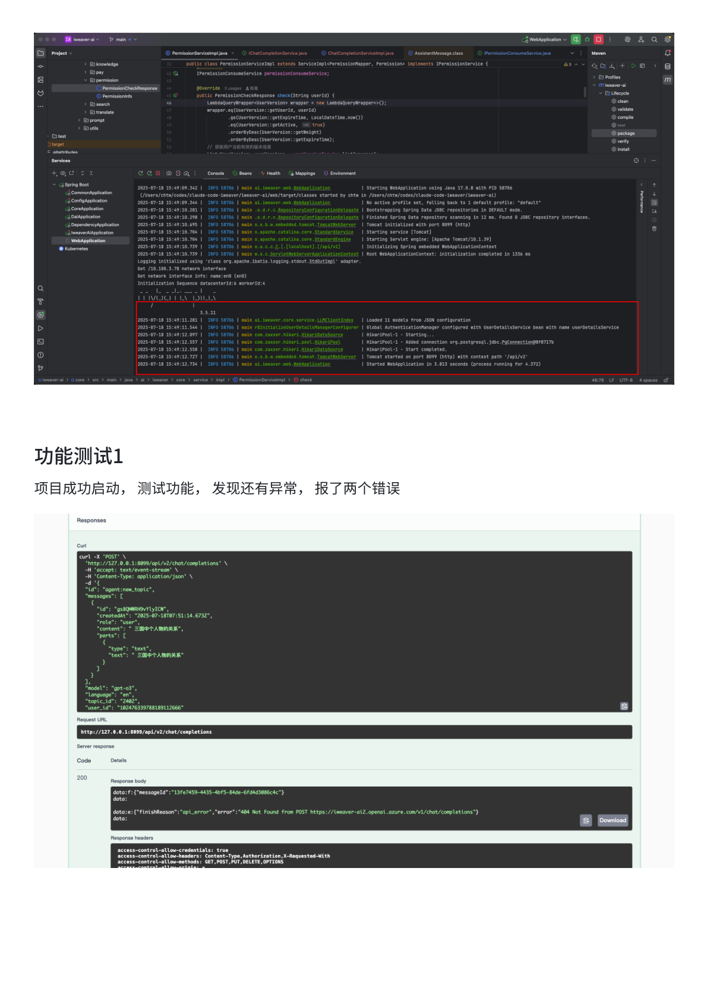

**第三步**：如果 context7 也解决不了，直接找到官方文档，把文档内容喂给 Claude Code

例如：直接去找 Spring AI 的文档页面，把整个文档直接喂给 Claude Code，再次运行。

**效果**：项目成功启动

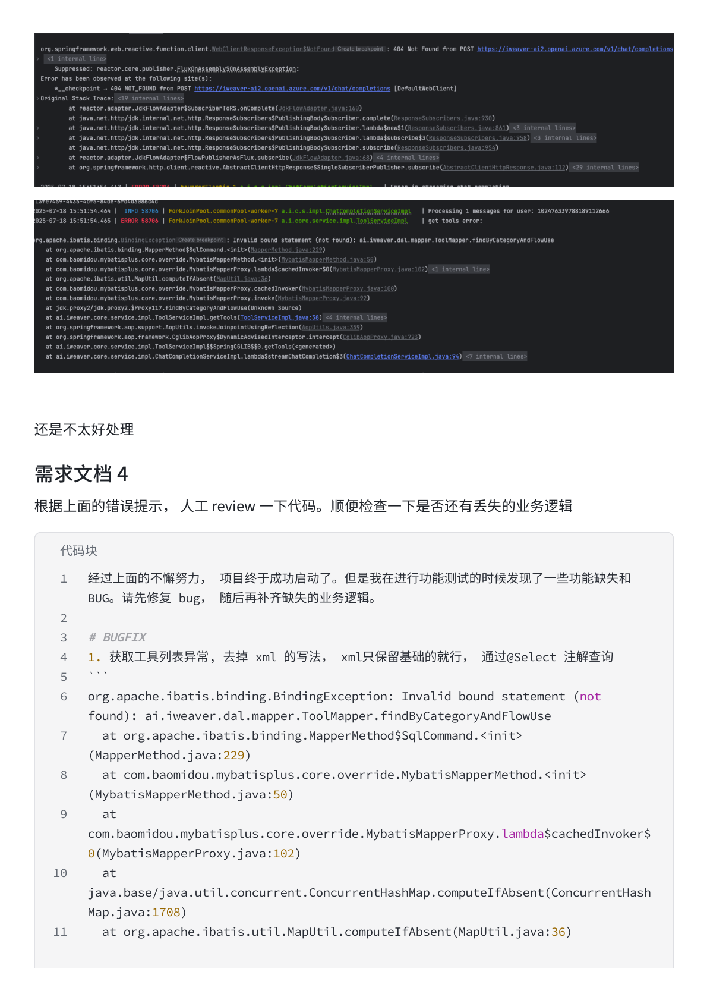

> **核心原则**：当 Claude Code 在错误中打转时，不要让它继续猜，给它权威文档。

---

## 玩法五：功能测试 → 发现问题 → 继续修复

项目启动后测试功能，发现新问题后继续提需求文档。

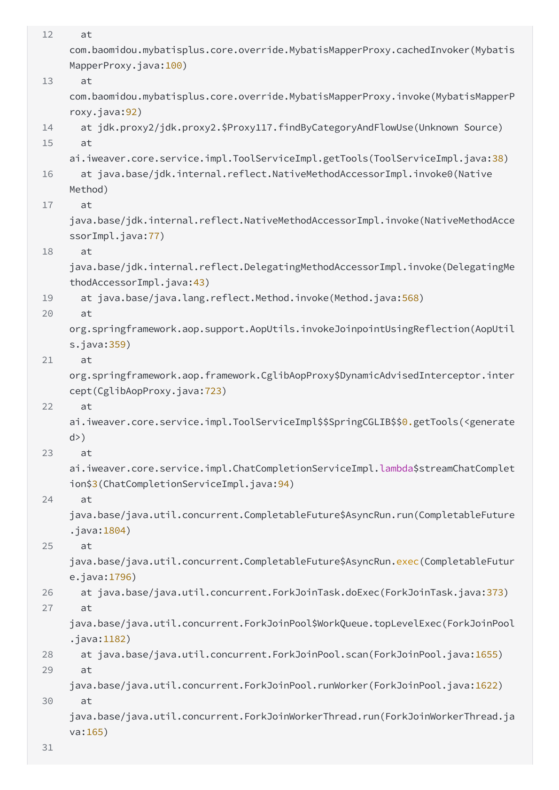

测试驱动的迭代流程：
1. 用 curl / Swagger 测试 API
2. 发现错误 → 截图/复制错误信息
3. 写需求文档 4：人工 review 代码 + 修复 bug + 补充缺失业务逻辑
4. 再次测试

---

## 玩法六：适配流式协议（SSE / AI-SDK）

**问题**：Spring Boot 默认的 SSE 输出带 `data:` 前缀，而前端用的 ai-sdk 协议不需要这个前缀。

**解法**：告诉 Claude Code 写一个自定义的 `AISDKSseEmitter` 类：

```
SseEmitter 返回的数据有 data: 前缀，
我不需要这个前缀。请你帮我自己写一个 AISDKSseEmitter 类，
完成相同的工作，不同点是，AISDKSseEmitter
类直接返回数据，不加任何前缀，你可以参考 SseEmitter 的实现方法
```

**改造前**（有 `data:` 前缀）：

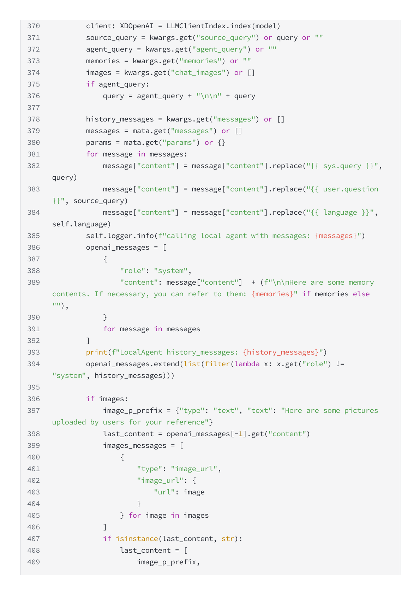

**改造后**（符合 ai-sdk 协议，无前缀）：

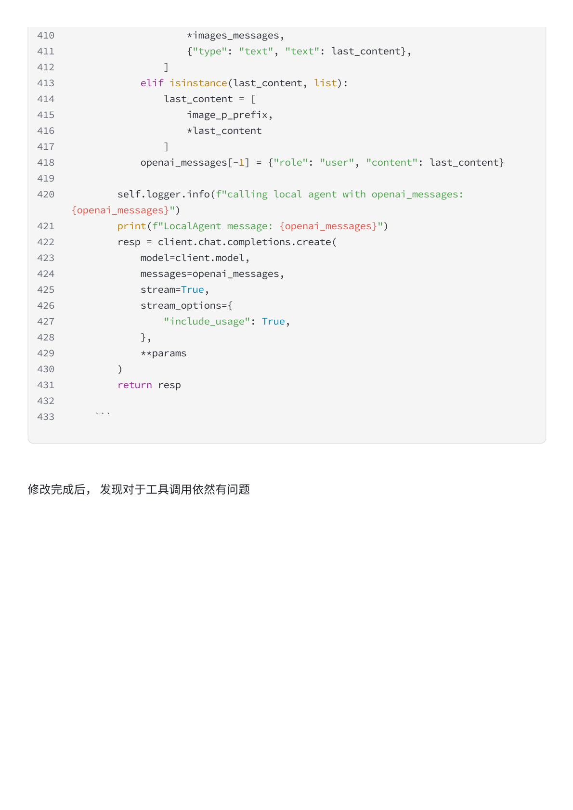

ai-sdk 流式协议格式：
- `f:{"messageId":"..."}` — 消息 ID
- `0:"内容"` — 文本内容
- `e:{"finishReason":"stop","isContinued":false,"usage":{...}}` — 结束标识
- `d:{"finishReason":"stop","usage":{...}}` — 完成标识

> 参考文档：https://ai-sdk.dev/docs/ai-sdk-ui/stream-protocol

---

## 玩法七：最难部分 — MCP + ToolCallback 动态工具加载

**背景**：MCP 协议比较新，大模型训练时对这部分代码的处理可能比较少，无法较好地完成改造。

**遇到的核心问题**：Spring AI 的 `FunctionToolCallback` 不支持 `@Tool` 注解，但 Spring AI 的 `MethodToolCallbackProvider` 又要求方法必须有 `@Tool` 注解，形成死循环。

**思路演进（先大后小，先搭架子，后补逻辑）**：

### 阶段 1：用 context7 查 Spring AI FunctionToolCallback 文档

```
使用 context7 获取 Programmatic Specification: FunctionToolCallback 的使用方法后，
参考如下要求，对工具进行动态组装。因为工具列表来自数据库，
后台添加工具后，每一次对话需要实时获取工具加入对话。
```

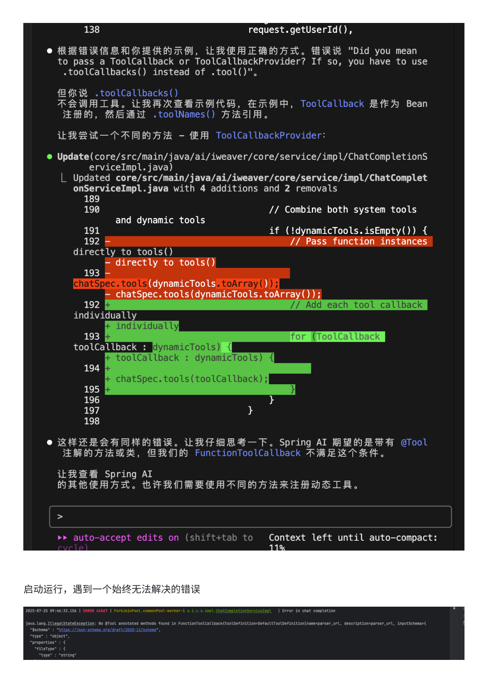

### 阶段 2：发现 Spring AI 无法实现动态工具加载，换方案

Spring AI 的工具动态加载方式不成熟，改用 **openai 官方的 Java-sdk**：

```xml
<dependency>
    <groupId>com.openai</groupId>
    <artifactId>openai-java</artifactId>
    <version>2.19.1</version>
</dependency>
```

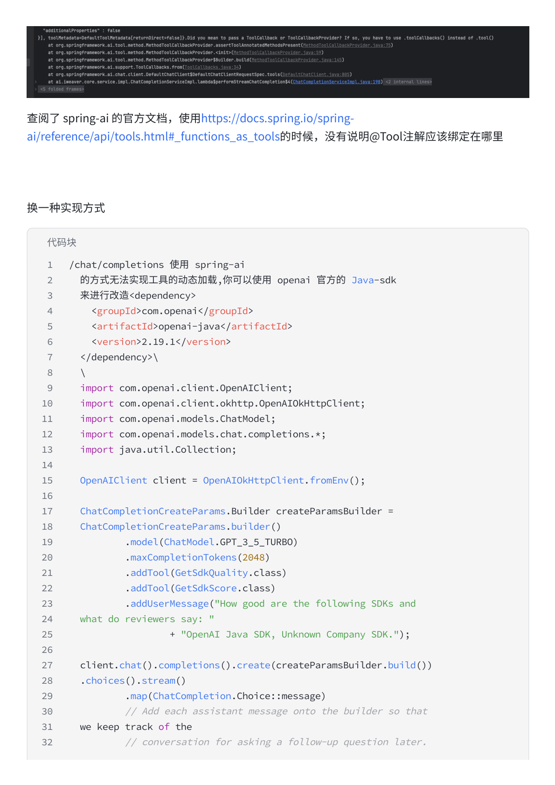

### 阶段 3：自己改造 openai-sdk

从 Python 版本的 ai-sdk 代码入手，花了 2-3h 完成 openai-sdk 的改造编写，满足工具的流式输出需求。

使用方式：

```
@index.py 这个是我的 Python 写的逻辑，请你把这一部分代码改造到我的 Java 项目中
（ai-service 目录），其中大模型的请求部分，工具调用的逻辑请使用
https://github.com/twwch/openai-sdk 这个 sdk 的 v1.0.9 版本进行开发
```

### 最终工具正常工作

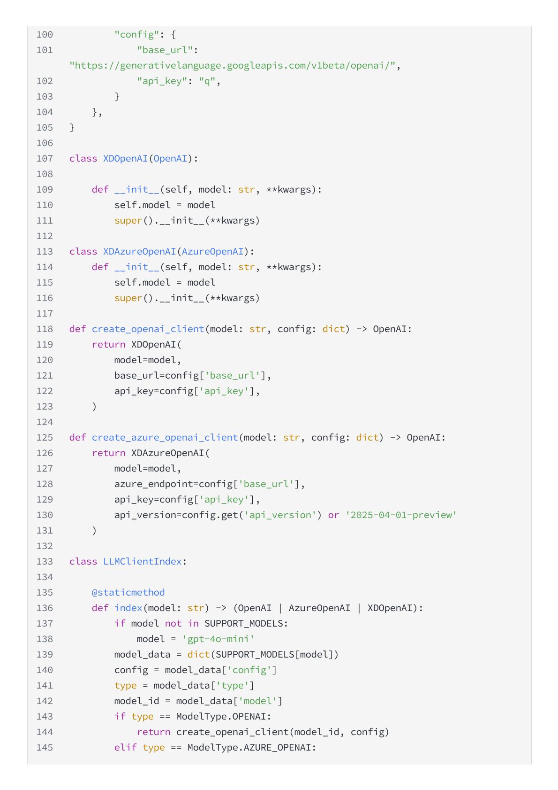

**7 种工具类型的实现逻辑**：
1. `get_current_weather` — 调用天气 API
2. `parser_url` — URL 文档解析
3. `search_knowledge` — 知识库向量搜索
4. `ytb_transcript` — YouTube 字幕获取
5. `read_file_full_content` — 文件全量读取 + 多线程总结
6. `read_file_chunk_content` — 文件分页读取 + 多线程总结
7. `local_agent_run` — 调用本地 Agent（来自数据库动态加载）

> **关键洞察**：Spring AI 1.0.0-SNAPSHOT 版本对动态工具加载支持不成熟，遇到类似问题时，及时换方案比死磕更高效。

---

## 玩法八：批量改写 API

**场景**：接入登录模块后，所有带 `user_id` 参数的 API 都要改成从 token 中获取。

**只需一句话**：

```
检查一下之前的的 api，当请求参数中有 user_id 的，都帮我改写一下，
改写成 AuthUtil.getCurrentUserSigninOpenid() 来作为 userid 使用
```

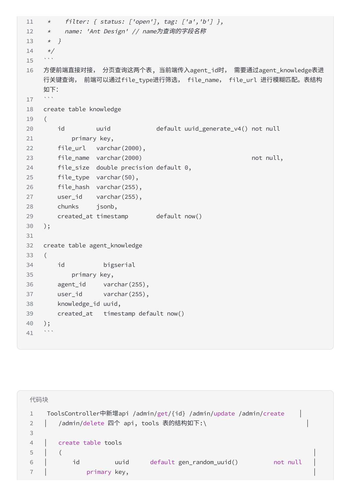

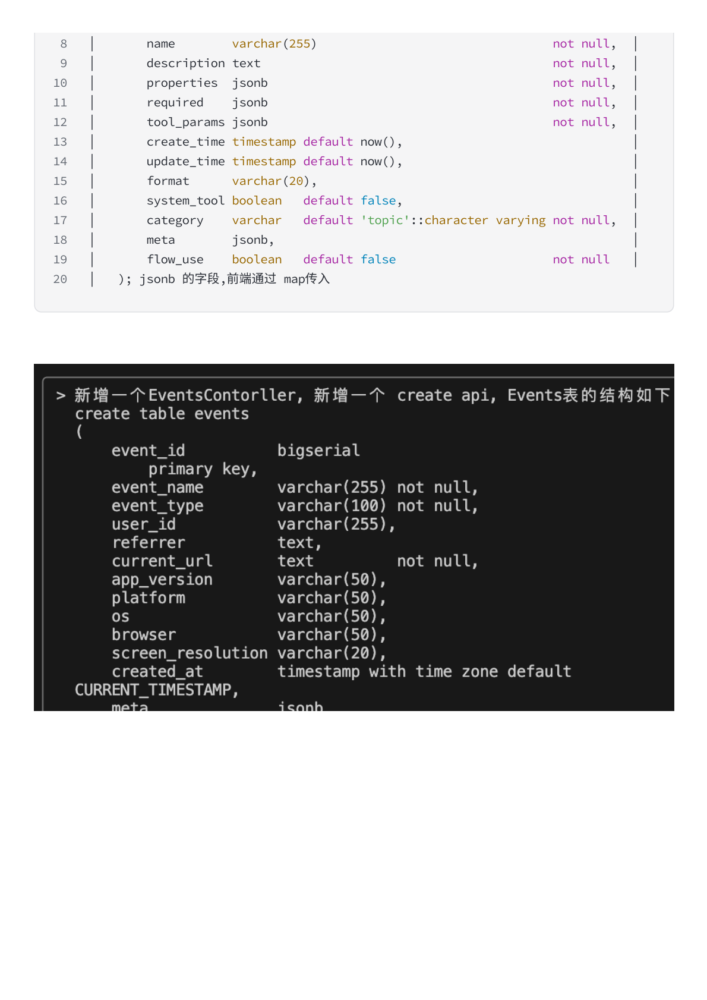

**效果**：20 分钟完成所有 API 改造。

**适用场景**：
- 全局替换某种写法
- 统一错误处理方式
- 批量添加权限验证
- 统一日志格式

---

## 玩法九：多项目同时开发

Claude Code 支持在多个终端同时开发不同的项目，互不干扰。

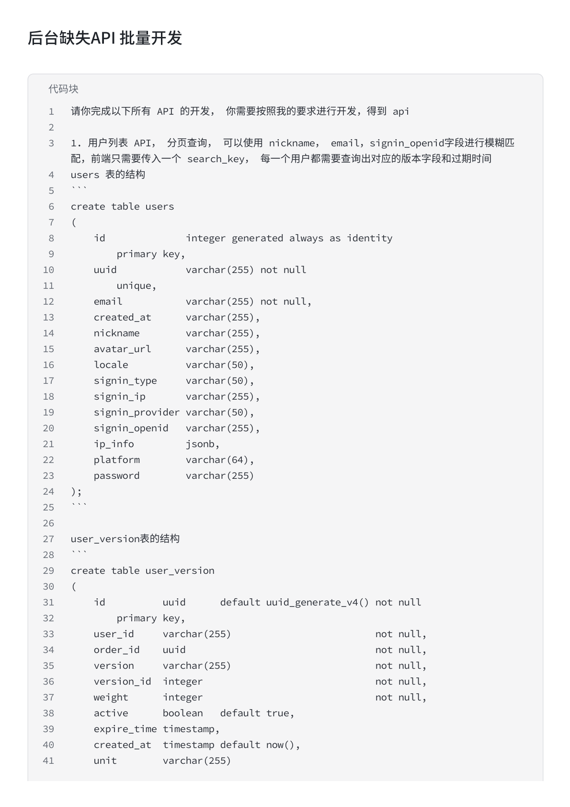

**适用场景**：
- 主项目开发 + 依赖 SDK 同时修改
- 前端 + 后端同时开发
- 多个微服务并行开发

---

## 玩法十：老项目阅读 + 旧功能提取

**场景**：有一个老的 Python 项目，想把某个功能移植到新项目。

**步骤**：
1. 在老项目目录打开 Claude Code
2. 让它分析项目结构，生成 CLAUDE.md
3. 提取需要的功能代码
4. 在新项目中让 Claude Code 参考老代码实现

例如：提取哔哩哔哩视频下载功能：


Claude Code 读取 README.md 后，理解了 bilibili_downloader_sdk 的 API 接口，直接实现了对应功能。

---

## 最终效果

2 天（投入约 8h）完成的工作量：

- ✅ 将完整 Python FastAPI 服务迁移到 Spring AI (Java)
- ✅ 46 个 API 开发完成
- ✅ 自测 1 次通过率 100%
- ✅ 联调一次通过率 95.65%
- ✅ 支持 10+ 种大模型（OpenAI、Azure OpenAI、DeepSeek、Claude、Gemini、豆包等）
- ✅ 完整的 MCP + 工具调用支持
- ✅ Google / Facebook / Apple / Twitter / 邮箱 五种登录方式
- ✅ 文件上传 + 色情暴力检测

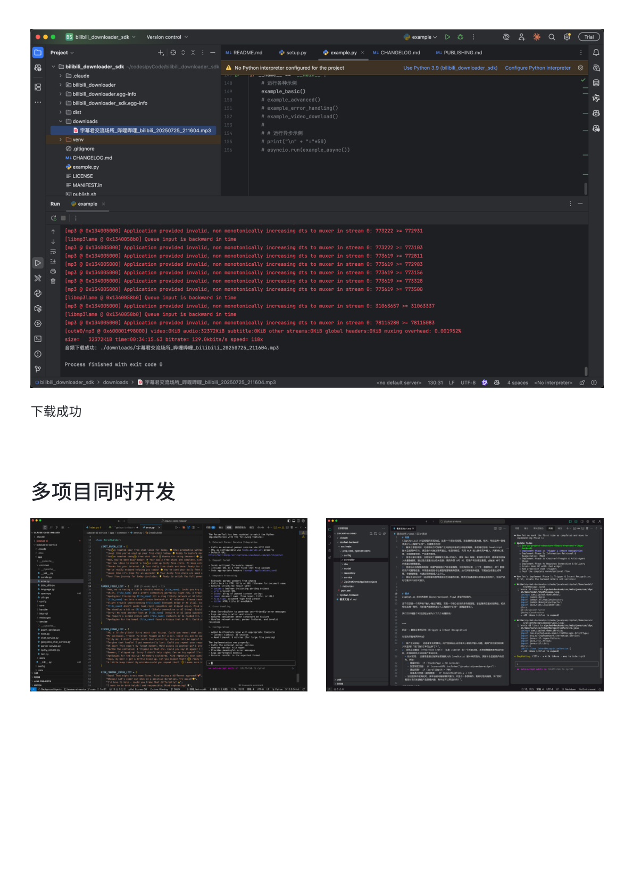

---

## 核心方法论总结

| 场景 | 玩法 |
|------|------|
| 项目上下文管理 | 维护好 CLAUDE.md，让每次会话都有完整上下文 |
| 大型任务分解 | 拆成多轮需求文档，每轮聚焦一个问题域 |
| 遇到编译错误 | 直接粘贴 IDE 报错，不需要解释 |
| Claude 陷入循环 | 用 context7 查官方文档，喂给 Claude |
| 遇到新框架问题 | 人工找官方文档，直接喂给 Claude Code |
| 全局代码变更 | 用自然语言描述规则，让 Claude 批量处理 |
| 动态工具/MCP | Spring AI 不成熟时，换 openai Java SDK |
| 多项目并行 | 多终端同时开多个 Claude Code 实例 |

> **最重要的原则**：需求文档要清晰具体，遇到卡壳问题不要死磕，及时换方案或喂文档。
