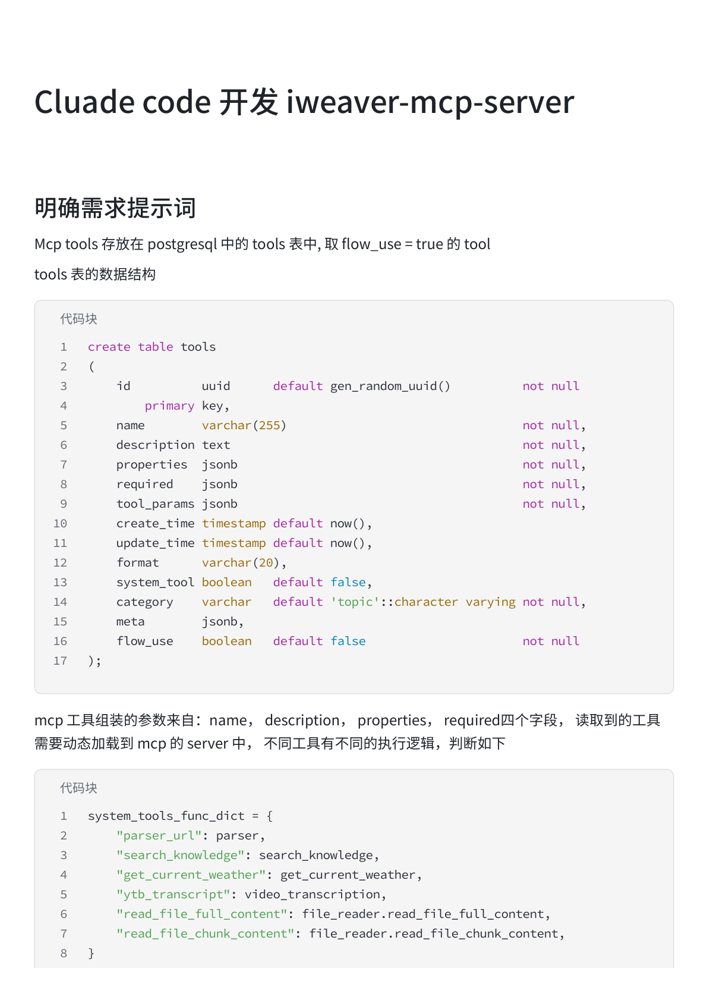
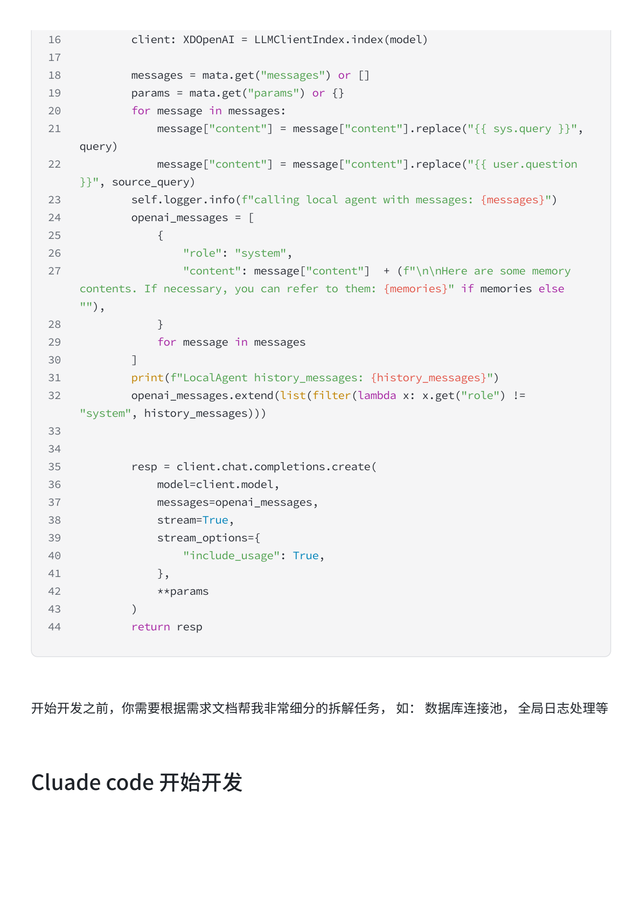
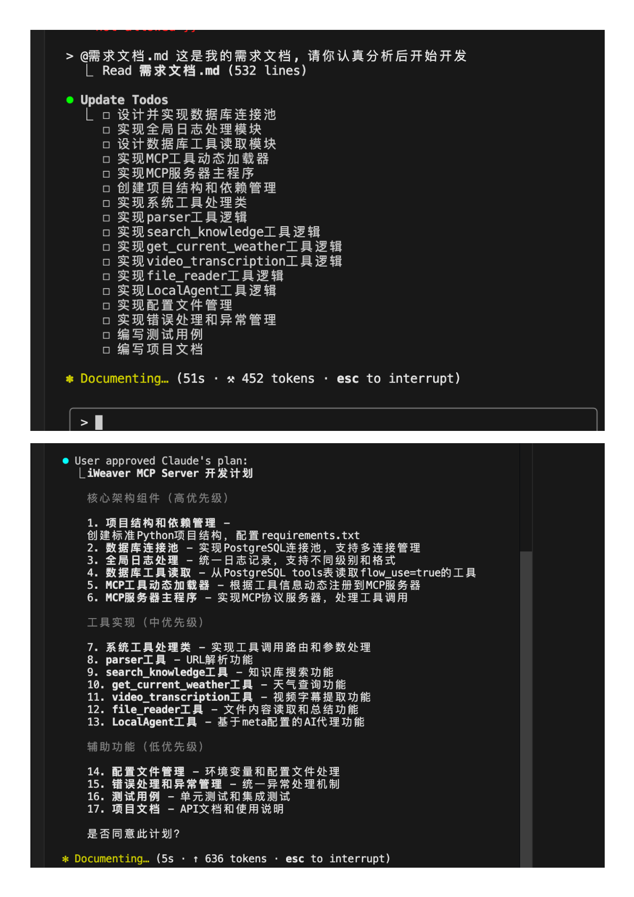
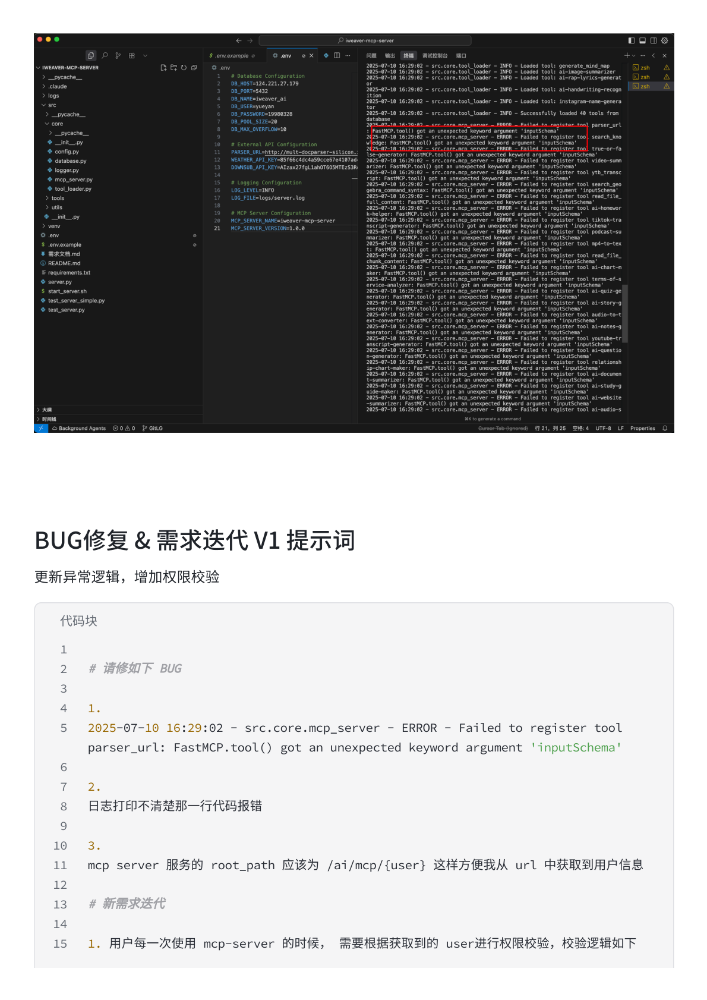
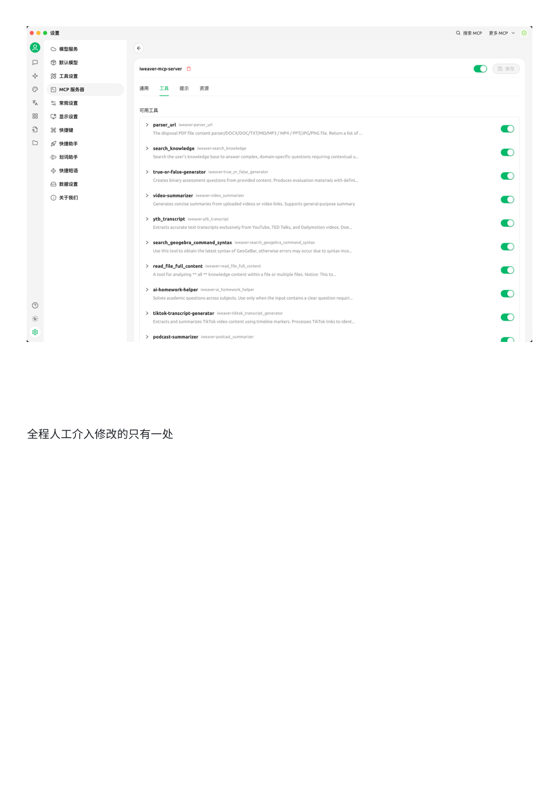
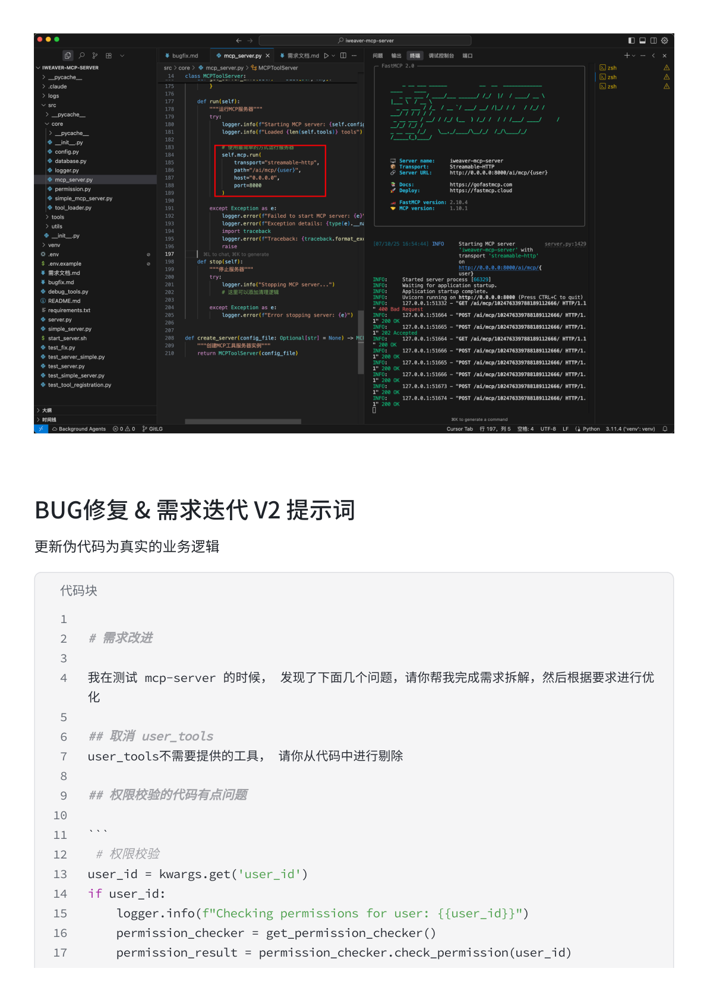
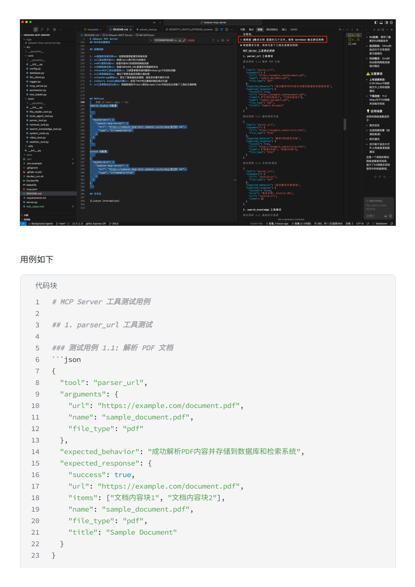
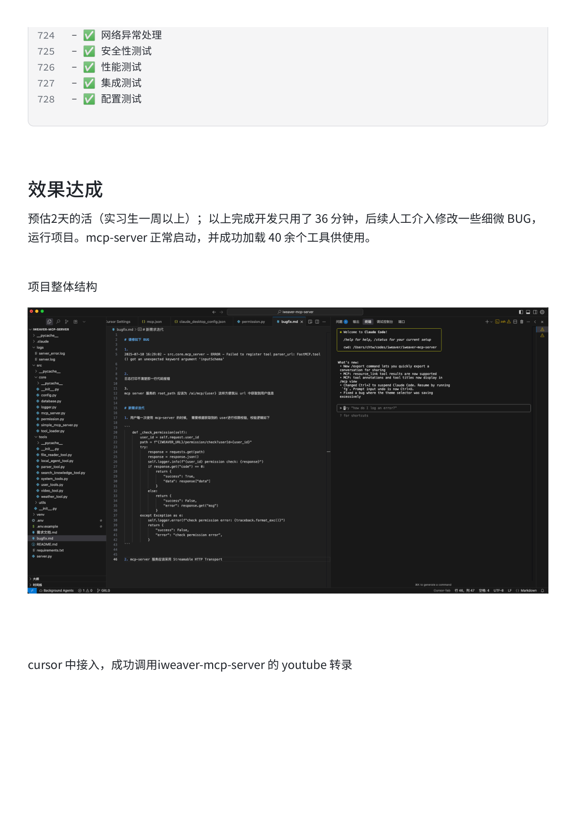
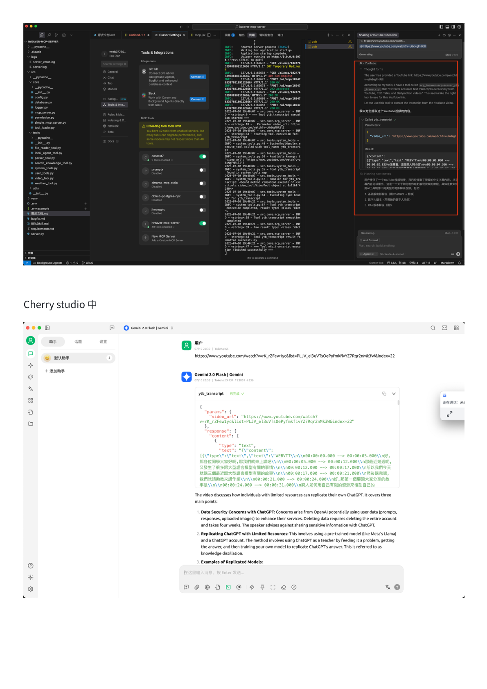
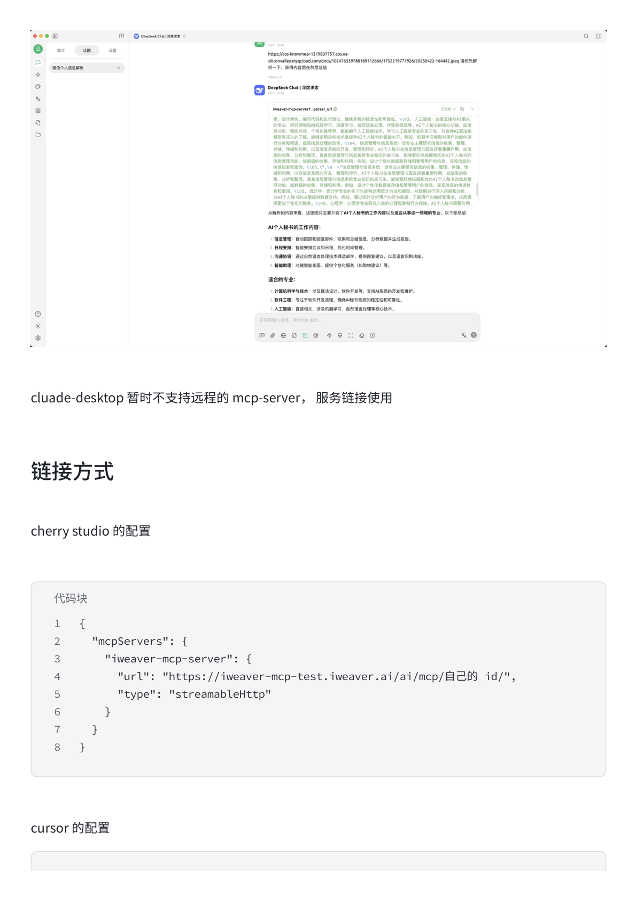

# Claude Code 开发 my-mcp-server

> 本文整理自一个真实案例：用 Claude Code 从零开发一个完整的 MCP Server（Python），预估 2 天工作量（实习生一周以上），实际只用了 **36 分钟**完成开发，后续人工介入修改一些细微 BUG，最终 mcp-server 正常启动，成功加载 40 余个工具。

---

## 一、明确需求提示词

**核心思路**：开发前把所有需求信息整理成一份清晰的需求文档，喂给 Claude Code。

### 需求文档内容包括

**1. 数据库表结构**

```sql
create table tools
(
    id           uuid         default gen_random_uuid() not null primary key,
    name         varchar(255)                           not null,
    description  text                                   not null,
    properties   jsonb                                  not null,
    required     jsonb                                  not null,
    tool_params  jsonb                                  not null,
    create_time  timestamp    default now(),
    update_time  timestamp    default now(),
    format       varchar(20),
    system_tool  boolean      default false,
    category     varchar      default 'topic'::character varying not null,
    meta         jsonb,
    flow_use     boolean      default false              not null
);
```

**2. 工具路由逻辑**

MCP 工具组装的参数来自 `name`、`description`、`properties`、`required` 四个字段，读取到的工具需要动态加载到 mcp 的 server 中，不同工具有不同的执行逻辑，判断如下：

```python
system_tools_func_dict = {
    "parser_url": parser,
    "search_knowledge": search_knowledge,
    "get_current_weather": get_current_weather,
    "ytb_transcript": video_transcription,
    "read_file_full_content": file_reader.read_file_full_content,
    "read_file_chunk_content": file_reader.read_file_chunk_content,
}
```

**3. 各工具的 Python 参考代码**（完整代码块直接提供给 Claude）

**4. LocalAgent 执行逻辑**（非以上工具时，走 LocalAgent.call 方法）

**5. 开发前任务拆解要求**：

```
开始开发之前，你需要根据需求文档帮我非常细分的拆解任务，
如：数据库连接池，全局日志处理等
```



---

## 二、Claude Code 开始开发

**发送方式**：

```
@需求文档.md 这是我的需求文档，请你认真分析后开始开发
```

Claude Code 读取需求文档后，**自动拆解了 17 个开发任务**：

```
□ 设计并实现数据库连接池
□ 实现全局日志处理模块
□ 设计数据库工具读取模块
□ 实现MCP工具动态加载器
□ 实现MCP服务器主程序
□ 创建项目结构和依赖管理
□ 实现系统工具处理类
□ 实现parser工具逻辑
□ 实现search_knowledge工具逻辑
□ 实现get_current_weather工具逻辑
□ 实现video_transcription工具逻辑
□ 实现file_reader工具逻辑
□ 实现LocalAgent工具逻辑
□ 实现配置文件管理
□ 实现错误处理和异常管理
□ 编写测试用例
□ 编写项目文档
```

Claude Code 同时生成了完整的 **MCP Server 开发计划**，并请求用户确认。



---

## 三、执行过程

用户确认计划后，Claude Code 开始自动执行所有任务：

- 同时展示左侧文件树（实时创建文件）和右侧 Todo 列表（实时更新进度）
- 自动创建项目结构、数据库连接池、日志模块、各工具实现...



**第一版开发完成，用时 18 分钟，存在 bug**

---

## 四、BUG 修复 & 需求迭代 V1

启动服务后发现报错，**直接把错误日志粘贴给 Claude Code**，同时补充新需求：

```python
# 请修复如下 BUG

1.
2025-07-10 16:29:02 - src.core.mcp_server - ERROR - Failed to register tool
parser_url: FastMCP.tool() got an unexpected keyword argument 'inputSchema'

2.
日志打印不清楚那一行代码报错

3.
mcp server 服务的 root_path 应该为 /ai/mcp/{user} 这样方便我从 url 中获取到用户信息

# 新需求迭代

1. 用户每一次使用 mcp-server 的时候，需要根据获取到的 user 进行权限校验，校验逻辑如下
```

权限校验代码示例：

```python
def _check_permission(self):
    user_id = self.request.user_id
    path = f"{APP_URL}/permission/check?userId={user_id}"
    try:
        response = requests.get(path)
        response = response.json()
        if response.get("code") == 0:
            return {"success": True, "data": response["data"]}
        else:
            return {"success": False, "error": response.get("msg")}
    except Exception as e:
        return {"success": False, "error": "check permission error"}
```



**开发完成，用时 18 分钟，启动服务，工具正常加载**



---

## 五、BUG 修复 & 需求迭代 V2

继续测试发现问题，提交第二轮迭代：

```python
# 需求改进

我在测试 mcp-server 的时候，发现了下面几个问题，请你帮我完成需求拆解，然后根据需求进行优化

## 取消 user_tools
user_tools不需要提供的工具，请你从代码中进行删除

## 权限校验的代码有点问题

# 权限校验
user_id = kwargs.get('user_id')
```

关键修复：`user_id` 不在 kwargs 参数中，应该从 url 中获取：

```python
from fastmcp.server.dependencies import get_http_request

request = get_http_request()
user_id = request.path_params.get('user_id')
```

2. mcp-server 服务应该采用 Streamable HTTP Transport



**全程人工介入修改的只有一处**

---

## 六、测试用例编写

开发完成后，让 Claude Code 生成完整的测试用例文档（README 中 MCP Server 工具测试用例部分）。

Claude Code 自动生成了涵盖以下所有场景的测试用例：

| 测试类别 | 覆盖工具/场景 |
|---------|-------------|
| `parser_url` 工具测试 | 解析 PDF/HTML、无效 URL |
| `search_knowledge` 工具测试 | 基础搜索、主题过滤、无权限用户 |
| `get_current_weather` 工具测试 | 查询城市天气、无效城市 |
| `ytb_transcript` 工具测试 | YouTube/TED/不支持平台 |
| `read_file_full_content` 工具测试 | 读取完整/不存在文件 |
| `read_file_chunk_content` 工具测试 | 读取分页内容 |
| 权限验证测试 | 有效用户/配额耗尽/缺少用户ID |
| LocalAgent 工具测试 | 基础执行/LLM 调用失败 |
| 数据存储验证测试 | Parser 结果存储/权限消费记录 |
| 错误处理测试 | 网络超时/数据库连接失败 |
| 配置和环境测试 | 环境变量/数据库连接配置 |
| 集成测试 | 完整工作流/多用户并发 |
| 安全测试 | SQL 注入防护/XSS 防护 |
| 性能测试 | 大文件处理/批量搜索 |

**测试覆盖率要求**：
- 代码覆盖率 > 80%
- 功能覆盖率 = 100%
- 边界条件覆盖率 > 90%
- 错误处理覆盖率 > 95%



---

## 七、效果达成

**预估 2 天的活（实习生一周以上），以上完成开发只用了 36 分钟**，后续人工介入修改一些细微 BUG，运行项目。mcp-server 正常启动，并成功加载 40 余个工具供使用。



---

## 八、多客户端接入

### Cursor 接入

成功调用 my-mcp-server 的 YouTube 转录功能：



### Cherry Studio 接入

在 Cherry Studio 中使用 Gemini 2.0 Flash 调用 `ytb_transcript` 工具，成功获取 YouTube 视频字幕内容：



### 注意事项

> **Claude Desktop 暂时不支持远程的 mcp-server，服务链接使用**

---

## 九、链接配置方式

### Cherry Studio 配置

```json
{
    "mcpServers": {
        "my-mcp-server": {
            "url": "https://xxx.example.com/ai/mcp/自己的 id/",
            "type": "streamableHttp"
        }
    }
}
```

### Cursor 配置

```json
{
    "mcpServers": {
        "my-mcp-server": {
            "url": "https://xxx.example.com/ai/mcp/自己的 id/",
            "type": "streamable-http"
        }
    }
}
```


---

## 核心方法论总结

| 阶段 | 做法 | 用时 |
|------|------|------|
| 需求准备 | 整理数据库结构 + 工具路由逻辑 + Python 参考代码 → 一份需求文档 | 提前准备 |
| 开始开发 | `@需求文档.md` 喂给 Claude Code，要求先拆解任务 | — |
| 第一版 | Claude Code 自动执行 17 个子任务 | 18 分钟 |
| BUG修复V1 | 粘贴错误日志 + 补充权限校验需求 | 18 分钟 |
| BUG修复V2 | 修正 user_id 获取方式 + 切换 Streamable HTTP | 少量时间 |
| 测试用例 | 让 Claude Code 生成完整测试文档 | 自动生成 |

**关键洞察**：
- **需求文档是核心**：把 DB 结构、路由逻辑、参考代码都塞进去，Claude Code 能几乎完美理解
- **先拆解任务**：让 Claude Code 先生成开发计划并确认，避免方向跑偏
- **错误日志直接粘贴**：不需要解释，Claude Code 能自动定位并修复
- **新协议直接说明**：`Streamable HTTP Transport` 这类新标准，直接在需求迭代中告知即可
