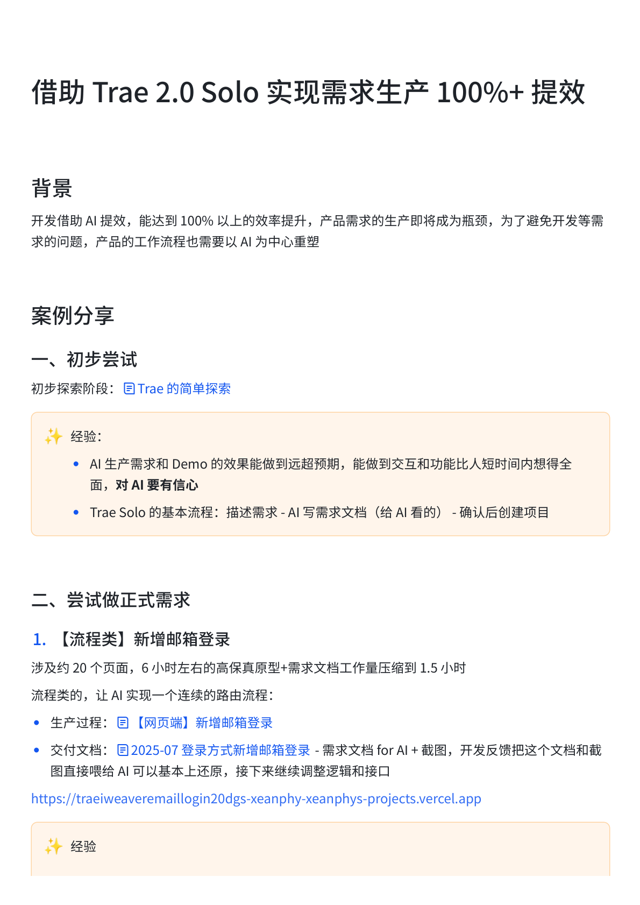
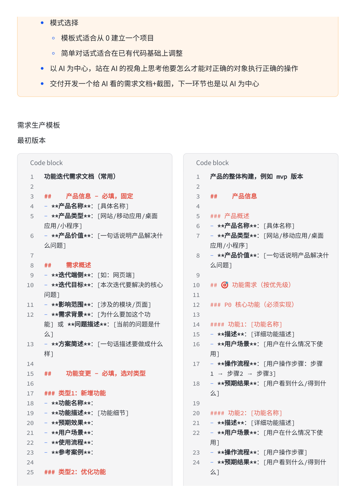
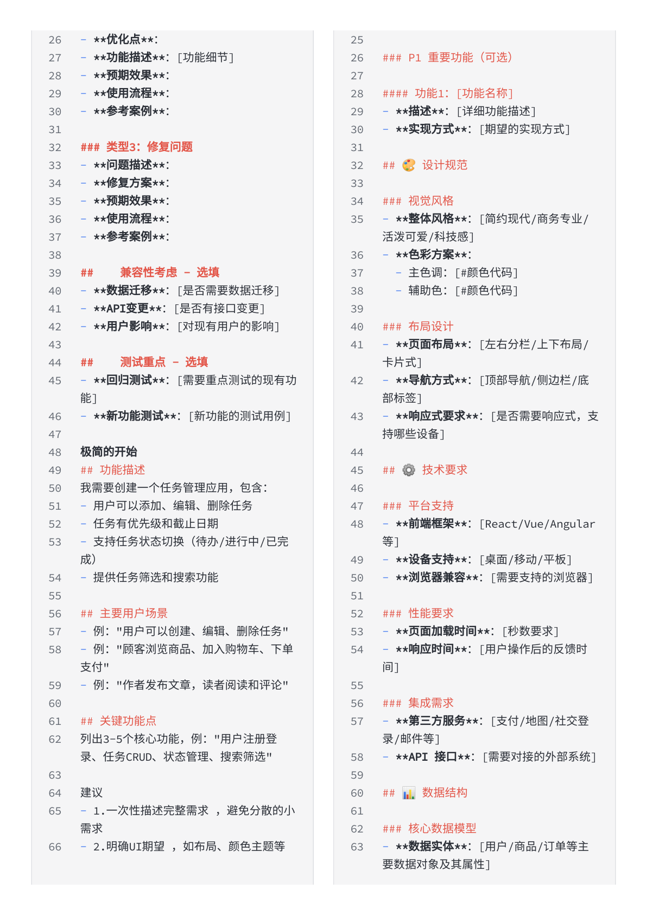
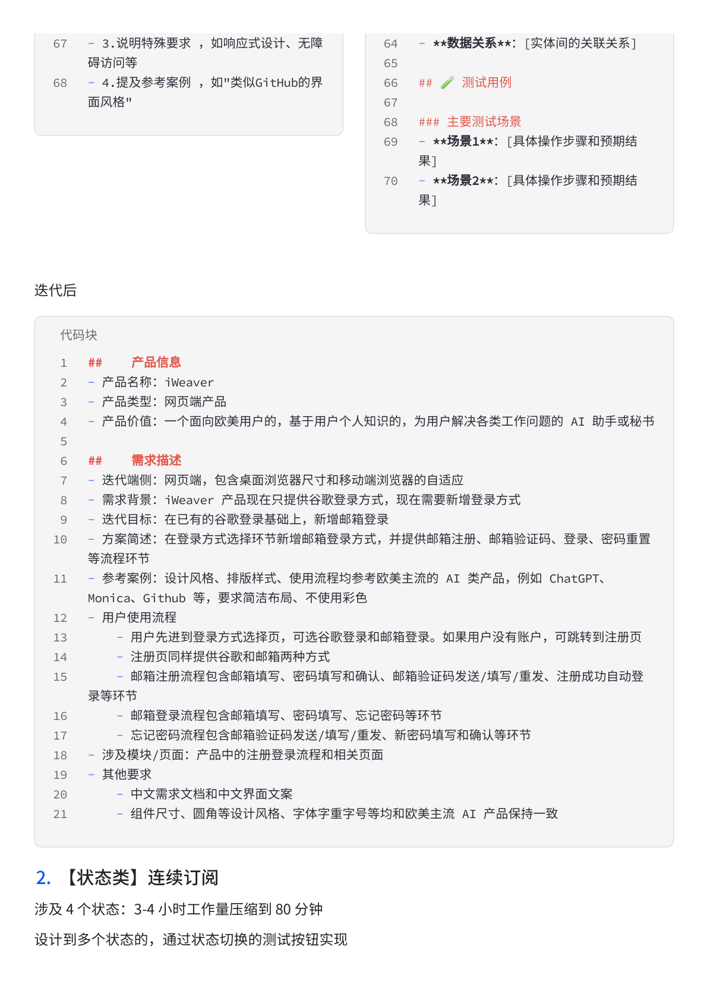
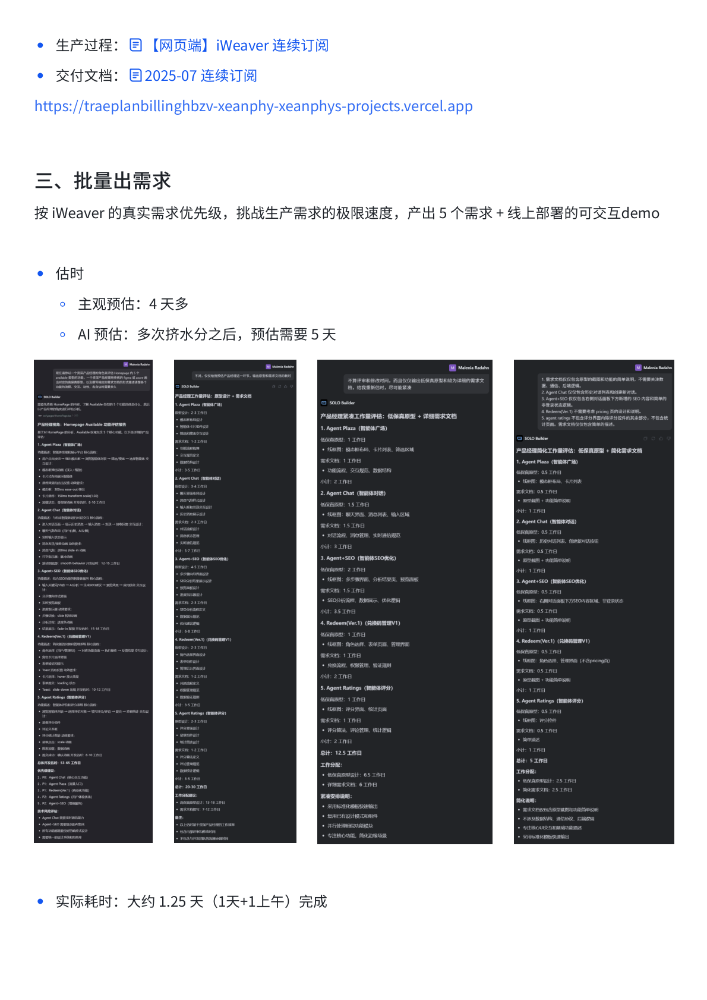
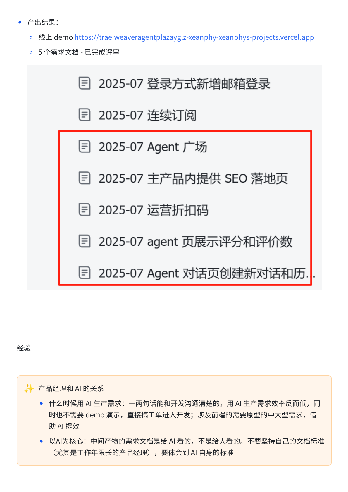
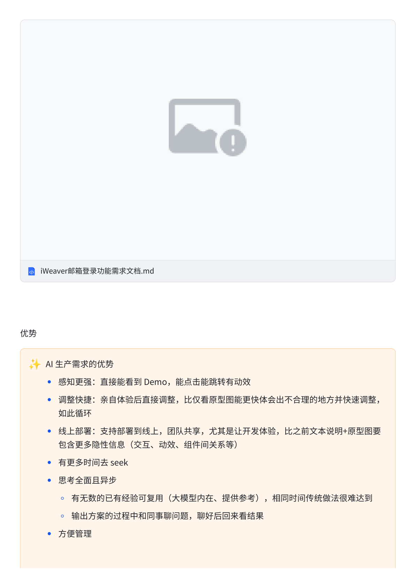
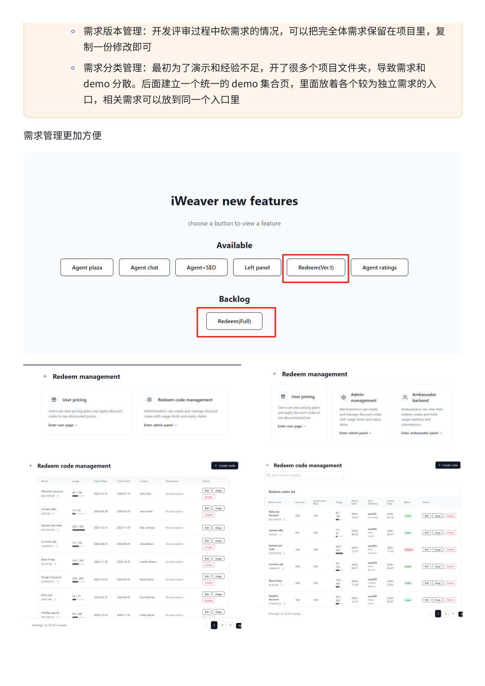
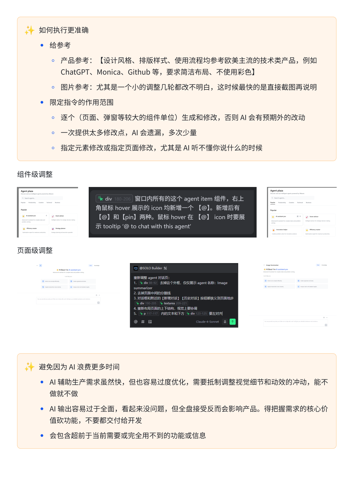
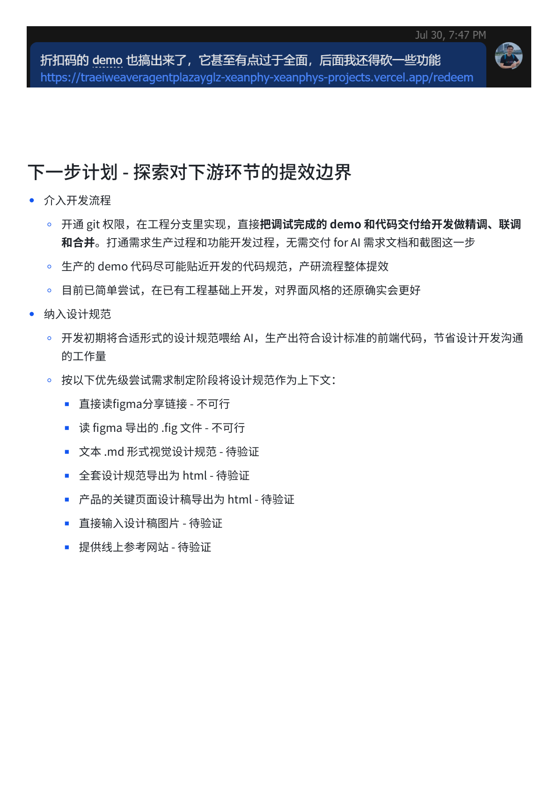

# 借助 Trae 2.0 Solo 实现需求生产 100%+ 提效

> 本文整理自一个真实案例：用 Trae 2.0 Solo（AI IDE）辅助产品经理生产需求文档，将需求生产效率提升 100% 以上。核心思路：让 AI 以 AI 为中心生成需求文档，再交给 AI 开发。

---

## 背景

开发借助 AI 提效，已超 100% 以上的效率提升。产品需求的生产部分成为瓶颈，为了避免开发等需求的问题，产品和工作流程也需要以 AI 为中心重塑。



---

## 一、初步尝试

**经验**：
- AI 生产需求和 Demo 的效果能做到远超预期，能做到文互互动和功能上短时间内传播全面，对 AI 要有信心
- Trae Solo 的基本流程：描述需求 → AI 写需求文档（给 AI 看的）→ 确认后创建项目

---

## 二、需求文档模板

### 最初版本（基础迭代版）

需求模板结构：

```markdown
## 产品信息
**产品名称**、**具体功能**、**预期效果**、**实现方式**

## 需求概述
- 功能变更内容
- 页面/区域/功能点描述

## 兼容与测试
- 兼容说明
- 测试方式

## 设计规范
- 色彩方案（原代码）
- 布局设计（左右栏等）
- 导航方式（顶部栏等）

## 技术要求
- 前端框架（React/Vue/Angular）
- 设备支持（桌面/移动优先等）

## 第三方系统

## 主要用户流程
- 步骤 1→（步骤描述）
- 步骤 2→（步骤描述）

## 数据结构/功能要求

## 测试用例
- 验证功能是否符合要求
```



### 完整版模板（详尽产品版）

适合较复杂的功能，包含：
- `##` 产品信息
- `###` 需求概述（功能变更）
- `###` 兼容性
- `###` 测试（测试要点）
- `###` 设计规范（组件样式/配色/布局/导航/品牌）
- `###` 技术要求（前端框架/平台支持）
- `###` 第三方系统（API 依赖关系）
- `##` 主要用户流程
- `###` 数据结构/功能要求



---

## 三、案例详解

### 案例一：【流程类】新增邮箱登录

**涉及约 20 个页面，6h 工作量压缩至 1.5h**

**传统做法的问题**：
- 需要：逐页标注，包括多层交互细节
- 难点：跨页面一致性，页面逻辑分叉

**Trae Solo 做法**：
1. 在 Trae Solo 里创建一个新项目
2. 描述需求 → AI 写需求文档 → 确认 → 开始开发

**文档内容示例**：
```
产品信息：MyApp，多用户个性化、为产品需求工作 AI 助手助手
迭代原因：拓宽来自市面部分层次多样化的通道登录和增加邮箱登录
参考资讯：MyApp 在有网页设计/移动视觉等功能拿出考虑最新整套外观风格
参考文档：...
主要变更：支持用邮箱创建账户，配合重置密码，邮件通知流程...
```

- 生产过程：[同页端] MyApp 邮箱登录
- 交付文档：2025-07 登录方式新增邮箱登录.md



---

### 案例二：【状态类】连续订阅

**涉及 4 种状态，3-4h 工作量压缩至 80 分钟**

**设计多了状态切换，通过过滤态态的测试过程**

- 生产过程：[同页端] MyApp 连续订阅
- 交付文档：2025-07 连续订阅.md



---

## 四、批量出需求

**背景**：项目有大量真实需求完成后，挑战生产需求的极限速度，产出 5 个需求 + 线上部署的可交互 demo。

**传统预估时间：4 天多**
**AI 预估**：多次迭代之后，预估需要 5 天

**实际耗时：约 1.25 天（1天+1上午）完成**

**产出结果**：
- 线上 demo：（已部署到 Vercel）
- 5 个需求文档，已完成评审

**5 个需求文档列表**：
1. 2025-07 登录方式新增邮箱登录
2. 2025-07 连续订阅
3. 2025-07 Agent 广场
4. 2025-07 主产品内提供 SEO 落地页
5. 2025-07 运营折扣码
6. 2025-07 agent 页展示评分和评价数
7. 2025-07 Agent 对话页创建新对话和历史...



---

## 五、经验总结

### 产品经理与 AI 的关系

**关于 AI 生产需求**：
- 什么时候用 AI 生需求：一两句话描述和开发沟通清楚的，用 AI 生产需求反而低效，同时也只需要 demo 演示，直接搭工工件进入开发；涉及功能的需求层面中大型需求，借助 AI 提效
- **以 AI 为中心**：生产出来的需求文档是给 AI 看的，不是给人看的，不要坚持自己的文档标准（尤其是工作年限长的产品经理），否则会和 AI 自身对抗

### AI 生产需求的优势

- **感知更强**：直接能看到 Demo，能点击能跳转有动效
- **调整快捷**：亲自体验后直接调整，比仅看原型图能更快体会出不合理的地方并快速调整，如此循环
- **线上部署**：支持部署到线上，团队共享，尤其是让开发体验，比之前文本说明+原型图要包含更多隐性信息（交互、动效、组件间关系等）
- **有更多时间去 seek**
- **思考全面且异步**：
  - 有无数的已有经验可复用（大模型内在、提供参考），相同时间传统做法很难达到
  - 输出方案的过程中和同事聊问题，聊好后回来看结果
- **方便管理**



### 需求版本管理

- 开发评审合并历次讨论问题的过程，可以把完整的需求文件保存到项目里，重复一份修改可
- 需求分步管理：最初为了清楚和起始处处处，开了多个项目文件，导致需求和 demo 分散，后画建成一个一般 demo 集合页，里面放着各个独立需求的入口，相关需求可以放到同一个入口里



---

## 六、如何做得更准确

### 给参考考

- **产品参考**：【设计风格、排版样式、使用流程分享等优美流美术风格的案例，例如 ChatGPT、Monica、Github 等，要求高活布局，使用请彩色】
- **图片参考**：尤其是一个功能的调整几乎与原功能截图不相同，这时候领域最快的截图直接图画说明
- **限定指令针的使用范围**：生成功能之后，告诉 AI 整合和修改，告诉 AI 有其明别的功效

### 限定指令的使用范围
- 一次性能修改较大功能，生成之后，告知用分段整合取用
- 避免对话当中大量传输指令，AI 会造成一些效果无效

### 组件级调整



每个 agent item 组件，右上角每隔 hover 展示 icon 图标一个——（示例）并在有 [+] 和 [x] 时，展示一个 tooltip "to chat with this agent"

### 页面级调整

展示在网页端所有的 agent item 组件，右上角每隔 hover 展示 icon 图标一个，并在有 [+] 和 [x] 时，添加 tooltip "to chat with this agent"

### 避免让 AI 消费更多时间

- AI 辅助生产需求虽然直接，但他但每次需要先优化，需要抵制调整视觉感觉和动效的冲动，能不
- AI 辅助设计但有下全面，看起来不来说说应用，但每个产品应用应用有很小小的
- AI 辅助设计但看但有全面，每每个但下面文档里面，把把需要先先先把把需要开发需求时的 2~3 个把写写完文档再发

---

## 七、下一步计划 — 探索对下游环节的提效边界

### 介入开发流程

- 开发初期合适形式代码的设计视觉搭建 AI，生产出符合设计标准的前端代码，节省设计开发沟通，配合对开发：
  - 接下花完成高还需求需求的制约需求设计工作向下去，已发现：
    - 直接 figma 分享链接：不可行
    - 直接 fig 导出的 .fig 文件：不可行
    - 直接截图规范视觉规范规格规范：待验证
    - 全套设计对整页需求到设计 html：待验证
    - 直接提供了计约类库规格图：待验证
    - 直接提供上参考网站：待验证



---

## 核心方法论总结

| 场景 | 做法 |
|------|------|
| 大型功能需求 | 用 Trae Solo 生成需求文档给 AI 开发用 |
| 小型沟通清楚的需求 | 直接 demo 演示，跳过文档 |
| 需求文档结构 | 以 AI 为中心写，不是给人看的 |
| 批量出需求 | 多个需求文档 + 统一 demo 集合页 |
| 视觉调整 | 优先组件级 → 页面级，减少大范围重写 |
| 参考资料 | 提供截图/网站/代码样例作为参考 |
| 避免浪费 | 不要过度调整视觉效果，避免 AI 消耗在非核心工作 |

> **最重要的原则**：需求文档是给 AI 看的，不是给人看的。以 AI 为中心重塑工作流，不要用传统文档标准约束 AI 生产。
